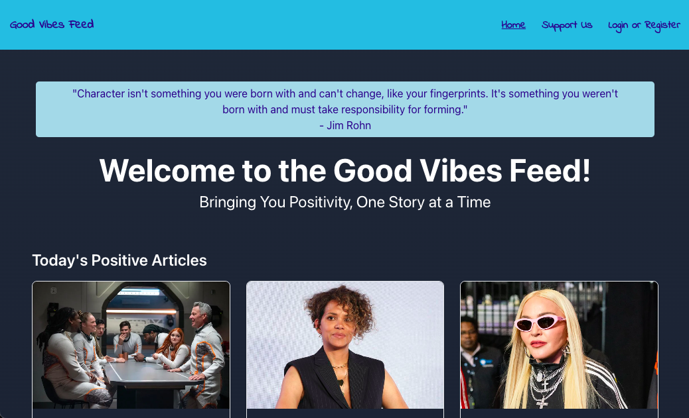

# Good Vibes Feed - README

Welcome to the [Good Vibes Feed](https://good-vibes-feed-0f727cb91a84.herokuapp.com/) project! This is a web application built using React for the frontend and Node.js with Express and MongoDB for the backend. The project aims to provide a platform where users can read and comment on positive and inspiring articles. Below, you'll find information about the project structure, setup, and key components.



## Table of Contents
- [Project Overview](#project-overview)
- [Getting Started](#getting-started)
  - [Installation](#installation)
  - [Running the App](#running-the-app)
- [Backend](#backend)
- [Frontend](#frontend)
- [Contributing](#contributing)
- [License](#license)

## Project Overview
The project consists of both frontend and backend components. The frontend is built using React, and the backend utilizes Node.js with Express for creating APIs and MongoDB for database storage.

## Getting Started

To visit the site, check us out [here](https://good-vibes-feed-0f727cb91a84.herokuapp.com/)

To run the Good Vibes Feed app [locally](http://localhost:3000/), follow the steps below.

### Installation
1. Clone the repository:
   ```sh
   git clone https://github.com/mcgrane18482/good_vibes_feed
   cd good-vibes-feed
   ```

2. Install backend and frontend dependencies:
   ```sh
   npm install
   ```

### Running the App
We have two options. To run the backend or frontend individually, follow these steps.
1. Start the backend server:
   ```sh
   cd server
   npm run dev
   ```

2. Start the frontend development server:
   ```sh
   cd client
   npm start
   ```

3. Open your web browser and navigate to [localhost](http://localhost:3000/) to use the Good Vibes Feed app.

If you want to run both sides concurrently, follow these steps from the root.
1. Start the frontend development server:
   ```sh
    npm run dev
   ```

2. Open your web browser and navigate to [localhost](http://localhost:3000/) to use the Good Vibes Feed app.


## Backend
The backend is built using Node.js and Express. It provides APIs for user authentication, registration, login, and article management. MongoDB is used as the database to store articles and user information. The backend code is located in the `server` directory.

Key files and folders:
- `server/routes/api_routes.js`: Contains APIs for managing articles and comments.
- `server/routes/user_routes.js`: Provides user authentication and authorization APIs.
- `server/models/Article.js`: Defines the MongoDB schema for articles.
- `server/models/User.js`: Defines the MongoDB schema for users.
- `server/auth/index.js`: Implements JWT token creation and validation.

## Frontend
The frontend is built using React and showcases the Good Vibes Feed interface. Users can read articles and leave comments. The frontend code is located in the `client` directory.

Key files and folders:
- `client/src/App.js`: The main React component rendering the app's UI.
- `client/src/pages/SingleArticle.js`: Renders individual articles with details and comments.
- `client/src/components/Comment.js`: Displays comments for an article.
- `client/src/pages/AuthForm.js`: Provides a login and registration form for users.

## Contributing
Contributions to the [Good Vibes Feed](https://good-vibes-feed-0f727cb91a84.herokuapp.com/) project are welcome! Feel free to submit issues, suggestions, or pull requests. When contributing code changes, please follow the existing coding style and conventions.

## License
The [Good Vibes Feed](https://good-vibes-feed-0f727cb91a84.herokuapp.com/) project is licensed under the [MIT License](LICENSE). You are free to use, modify, and distribute the code according to the terms of the license.

---

Thank you for checking out the [Good Vibes Feed](https://good-vibes-feed-0f727cb91a84.herokuapp.com/) project! We hope you enjoy using the app and find it a source of positivity and inspiration. If you have any questions or feedback, please don't hesitate to contact us.

Created with ❤️ by the Good Vibes Feed Team:

[Thomas Szentirmay](https://github.com/ThomasSzentirmay) - [Ryan Wysocki](https://github.com/rpwysocki) - [Erin McGrane](https://github.com/mcgrane18482) - [J.P. King](https://github.com/jp-king-1337) - [Brandon Lumar](https://github.com/brlumar)
